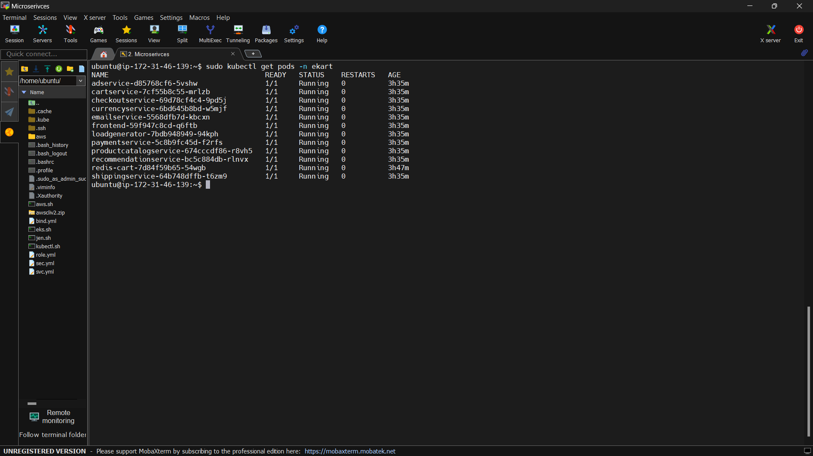

# 11-Microservices CI/CD Pipeline with AWS EKS & Jenkins

## 🚀 Overview
This project implements a **fully automated CI/CD pipeline** for an **eCommerce application** with **11 microservices** running on **AWS EKS**. The pipeline is powered by **Jenkins, Docker, Kubernetes, and GitHub**, ensuring seamless, scalable, and efficient deployments with zero manual intervention.

## 🔧 Tech Stack
- **Jenkins**: Multi-Branch Pipeline for CI/CD automation
- **Docker**: Containerization of microservices
- **Kubernetes (EKS)**: Orchestrating microservices
- **AWS IAM & OIDC**: Secure authentication & authorization
- **GitHub Webhooks**: Auto-triggering builds
- **Auto-Scaling**: Dynamic scaling of worker nodes

## 🌟 Features
✅ **11 Microservices** - Separate services for Cart, Payment, Shipping, etc.  
✅ **Jenkins Multi-Branch Pipeline** - Auto-triggers on every GitHub commit  
✅ **Docker + Kubernetes (EKS)** - Seamless deployments with auto-healing  
✅ **IAM OIDC Setup** - Secure AWS integration with least-privilege access  
✅ **Auto-Scaling Nodes** - EKS dynamically adjusts worker nodes  

## 💡 How It Works
1. **GitHub Integration**: Each microservice is managed in its own branch.  
2. **Jenkins Pipeline Execution**: Multi-Branch Scan Plugin detects changes & triggers CI/CD.  
3. **Docker Image Creation**: Images are built & pushed to Docker Hub.  
4. **Kubernetes Deployment**: The latest images are automatically rolled out on AWS EKS.  
5. **Auto-Scaling & Monitoring**: EKS ensures smooth performance with dynamic scaling.

## 📌 Deployment Flow
1. Developer commits code to GitHub.
2. GitHub Webhook triggers Jenkins Pipeline.
3. Jenkins pulls the latest code & builds Docker images.
4. Docker images are pushed to **Docker Hub**.
5. Kubernetes manifests deploy the latest images to **AWS EKS**.
6. EKS auto-scales worker nodes as per demand.

## 🎯 Real-World Use Case
By integrating **GitHub Webhooks & Jenkins Multi-Branch Pipeline**, this setup achieves **automated deployments with zero manual intervention**, ensuring a robust, scalable, and production-ready DevOps workflow. 🚀

## 📜 Prerequisites
- AWS Account with IAM permissions
- Kubernetes Cluster (EKS)
- Jenkins Server with required plugins
- Docker & Kubernetes CLI installed

## 🚀 Getting Started
1. Clone the repository:
   ```
   git clone https://github.com/imtiyaj43/Microservice.git
   cd Microservice
   ```
2. Configure AWS credentials & IAM OIDC.
3. Set up **Jenkins Multi-Branch Pipeline**.
4. Deploy microservices using Kubernetes manifests.
5. Monitor logs & scaling on **AWS EKS**.

## 📬 Contact
For any queries or improvements, feel free to connect on **[LinkedIn](https://www.linkedin.com/in/imtiyajshaikh/)** or open an issue in this repo. Happy DevOps! 🚀

For more details, check out my **[LinkedIn post](https://www.linkedin.com/posts/imtiyajshaikh_sunday-devops-microservices-activity-7304730525263376384-YWpr?utm_source=share&utm_medium=member_desktop&rcm=ACoAADGZpaEBlaey-QGm5DvwZ3nffNzmdDkvn70)**

## 🚀 Output
### 🖥️ Website
<div align="center">  </div>

### 🔄 CI/CD Pipeline Execution  
<div align="center">  </div>

### 📦 Pods Running in Kubernetes  
<div align="center">
  
</div>
